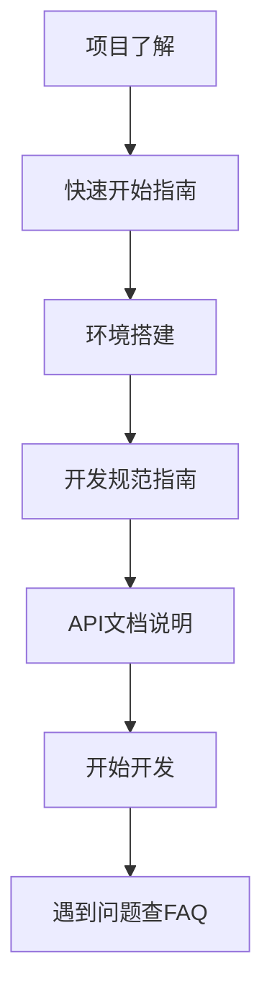

# 📁 项目文档结构说明

> 本文档说明了NestJS样板工程的文档组织结构和使用指南。

## 📋 文档结构概览

```
docs/
├── completed/              # 完成报告集合
│   ├── README.md          # 完成报告汇总索引
│   ├── DATABASE_INTEGRATION.md
│   ├── MYSQL_MIGRATION.md
│   ├── AUTH_SYSTEM_COMPLETED.md
│   ├── SECURITY_MIDDLEWARE_COMPLETED.md
│   ├── API_DOCS_COMPLETED.md
│   ├── PERFORMANCE_OPTIMIZATION_COMPLETED.md
│   ├── QUEUE_SYSTEM_COMPLETED.md
│   ├── TEST_FRAMEWORK_COMPLETED.md
│   ├── DEPLOYMENT_COMPLETED.md
│   └── DEVELOPMENT_STANDARDS_COMPLETED.md
├── DEVELOPMENT_GUIDE.md   # 开发规范指南
├── QUICK_START.md         # 快速上手指南
├── API_DOCUMENTATION.md   # API文档说明
├── FAQ.md                 # 常见问题解答
└── DOCUMENT_STRUCTURE.md  # 本文档
```

## 📚 文档分类说明

### 🎯 **快速入门文档** (优先级：⭐⭐⭐)

适合新开发者快速了解项目：

1. **[快速开始指南](./QUICK_START.md)** - 项目概述、环境搭建、快速启动
2. **[常见问题解答](./FAQ.md)** - 开发过程中的常见问题解决方案

### 📏 **开发规范文档** (优先级：⭐⭐)

团队开发必读的规范和标准：

1. **[开发规范指南](./DEVELOPMENT_GUIDE.md)** - 代码规范、项目结构、最佳实践
2. **[API文档说明](./API_DOCUMENTATION.md)** - API设计规范、接口使用方法

### 📊 **完成报告文档** (优先级：⭐)

技术实施细节和项目进度记录：

1. **[完成报告汇总](./completed/README.md)** - 所有功能模块的完成报告索引
2. **具体功能报告** - 各个功能模块的详细实施报告

## 🔍 文档查阅建议

### 新开发者入门路径



**推荐阅读顺序：**

1. 📖 [快速开始指南](./QUICK_START.md) - 了解项目全貌
2. 📏 [开发规范指南](./DEVELOPMENT_GUIDE.md) - 掌握开发规范
3. 🌐 [API文档说明](./API_DOCUMENTATION.md) - 学习API使用
4. ❓ [常见问题解答](./FAQ.md) - 解决开发问题

### 项目经理/技术负责人路径

**推荐阅读顺序：**

1. 📊 [完成报告汇总](./completed/README.md) - 了解项目完成度
2. 📖 [快速开始指南](./QUICK_START.md) - 掌握项目概览
3. 📏 [开发规范指南](./DEVELOPMENT_GUIDE.md) - 了解技术规范
4. 🔍 具体功能完成报告 - 深入了解技术细节

### 技术顾问/架构师路径

**推荐阅读顺序：**

1. 📊 [完成报告汇总](./completed/README.md) - 技术架构全貌
2. 🔍 [认证系统报告](./completed/AUTH_SYSTEM_COMPLETED.md) - 安全架构
3. 🔍 [性能优化报告](./completed/PERFORMANCE_OPTIMIZATION_COMPLETED.md) - 性能架构
4. 🔍 [部署运维报告](./completed/DEPLOYMENT_COMPLETED.md) - 部署架构

## 📝 文档维护规范

### 文档更新流程

1. **新功能开发** → 更新相关文档
2. **功能完成** → 创建完成报告
3. **版本发布** → 更新汇总文档
4. **定期回顾** → 检查文档时效性

### 文档命名规范

```bash
# 开发文档
DOCUMENT_NAME.md           # 使用UPPER_CASE命名

# 完成报告
FEATURE_NAME_COMPLETED.md  # 功能名_COMPLETED.md
MODULE_INTEGRATION.md      # 模块_INTEGRATION.md
SYSTEM_MIGRATION.md        # 系统_MIGRATION.md
```

### 文档结构规范

每个文档应包含：

- 📋 概述和目标
- ✅ 实施成果
- 📂 文件结构
- 🚀 使用指南
- 🎉 总结和后续计划

## 🔗 相关链接

### 项目根文档

- **[项目开发路线图](../DEVELOPMENT_ROADMAP.md)** - 项目整体规划和进度

### 外部资源

- **[NestJS官方文档](https://nestjs.com/)** - 框架官方文档
- **[TypeORM文档](https://typeorm.io/)** - ORM框架文档
- **[Docker文档](https://docs.docker.com/)** - 容器化文档

## 📞 文档反馈

如果您在使用文档过程中遇到任何问题或有改进建议，请通过以下方式反馈：

1. **GitHub Issues** - 提交文档问题或建议
2. **团队会议** - 在团队会议中讨论文档改进
3. **直接贡献** - 提交PR改进文档内容

---

**文档维护**: 项目开发团队  
**最后更新**: 2025-07-27  
**版本**: v1.0.0
